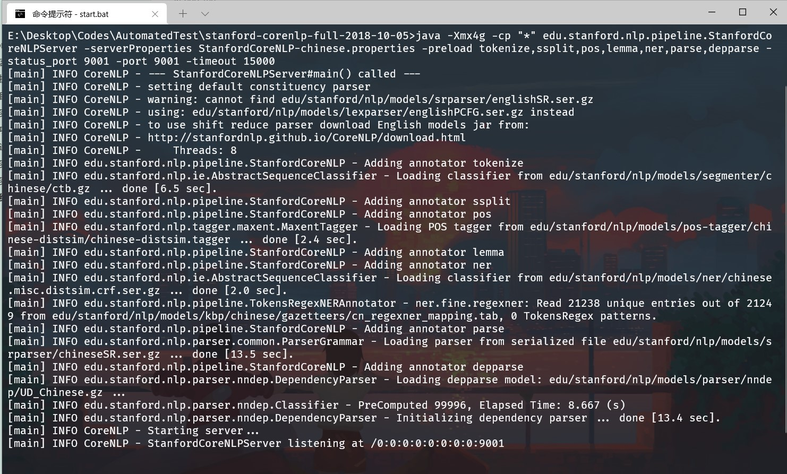
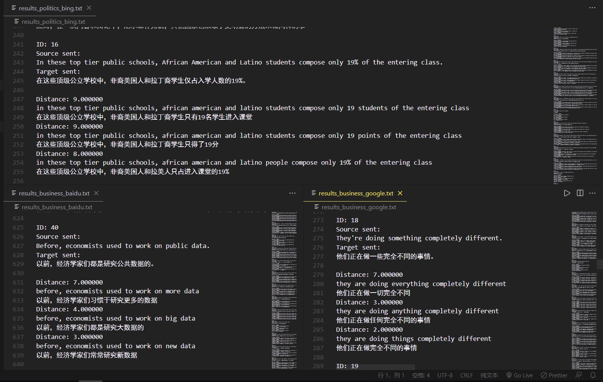
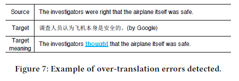
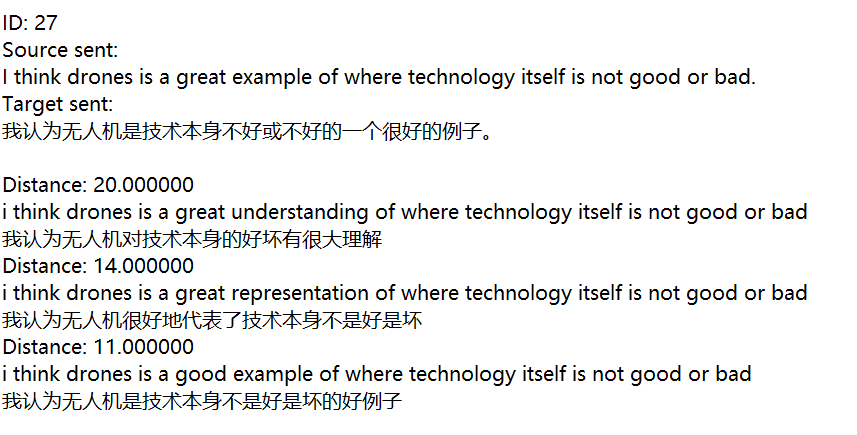
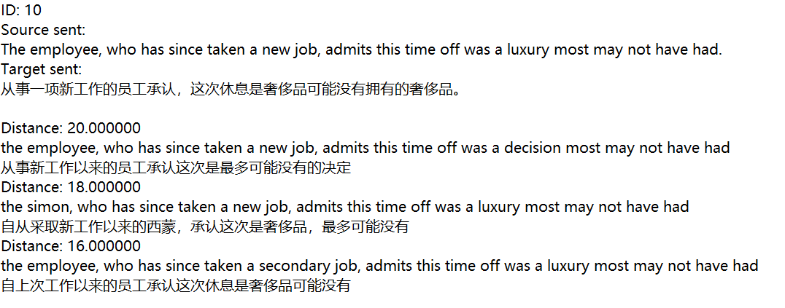
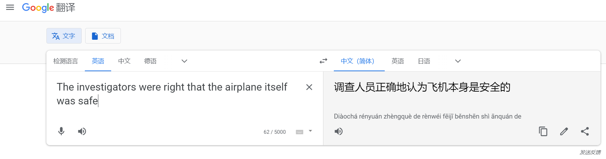

# AutomatedTesting2021

> 姓名：余欣然
>
> 学号：191250187
>
> 选题：AI文本扩增 《Structure-Invariant Testing for Machine Translation》
>
- [AutomatedTesting2021](#automatedtesting2021)
  - [Github 地址](#github-地址)
  - [引言](#引言)
  - [数据集](#数据集)
  - [翻译工具选择](#翻译工具选择)
  - [项目实践](#项目实践)
    - [实验环境](#实验环境)
    - [项目结构](#项目结构)
    - [运行步骤](#运行步骤)
    - [实现思路](#实现思路)
      - [初始化](#初始化)
      - [原始语句处理](#原始语句处理)
      - [扩增语句处理](#扩增语句处理)
      - [检验并写入结果](#检验并写入结果)
      - [文本扩增函数](#文本扩增函数)
      - [翻译调用主函数](#翻译调用主函数)
      - [距离计算函数](#距离计算函数)
    - [实验结果](#实验结果)
  - [总结思考](#总结思考)
    - [关于结果](#关于结果)
    - [更多的想法](#更多的想法)
    - [其它](#其它)

## Github 地址

https://github.com/XR-Y/AutomatedTest2021

## 引言

近年，机器翻译的重要性日渐凸显，神经网络机器翻译模型的复杂性和难驾驭却使得测试变得更加困难。论文中提出了“相似的语句应该具有相似的结构”的核心观点，并基于此实现了机器翻译的结构不变性测试工具（SIT）。本文档是对该工具复现的功能交互介绍，以及复现结果展示和思考。

## 数据集

在数据集方面为了后续和原始论文比较结果，直接采用了原论文中使用的数据集，即从CNN上抓取的business主题和politics主题下的语句各100句。

## 翻译工具选择

原论文选择了Google和Bing两种翻译工具进行测试，而由于Google Cloud注册时的信用卡必要需求，本复现采用了基于Google翻译的googletrans库。同时，基于当下环境，新加入了Baidu和Youdao两种翻译工具，最终选择共四种翻译工具进行测试。

## 项目实践

### 实验环境

- Windows10 21H1
- python3.7.9（anaconda）
- coreNLP 3.9.2
  - 需要额外下载`stanford-chinese-corenlp-2018-10-05-models.jar`放入文件夹
- pytorch 1.7.0
- googletrans 4.0.0rc1
- 使用的其余python库见SIT.py

### 项目结构

- AutomatedTest2021：项目总目录
  - Structure-Invariant Testing for Machine Translation.pdf：原始论文
  - dataset：项目数据集目录
    - business
    - politics
  - ppt+document：项目说明ppt和文档
  - results：项目运行结果文本文件总目录，包含四种翻译工具和两类数据集的共八种情况
  - stanford-corenlp-full-2018-10-05：项目使用的coreNLP工具
    - start.bat：启动脚本，写入了启动命令
    - …
  - store_results：项目运行中间结果JSON文件
    - res_perturb：文本扩增结果JSON文件
    - trans：四种翻译工具结果JSON文件
  - video：项目运行视频
  - SIT.py：项目源码文件

### 运行步骤

- ==出于安全考虑，翻译接口API相关secret删去了，保留有翻译结果，正常运行可以直接读取翻译结果无需调用翻译API==
- 设置SIT.py中的本次运行调用翻译及选用数据集等相关参数，补充各翻译API所需信息。
- 启动stanford-corenlp-full-2018-10-05文件夹下的start.bat，等待显示已经在9001端口正常运行。
- 运行SIT.py文件，若store_results文件夹下无中间结果文件可能需要运行较长时间。
- 查看results文件夹下的结果。

### 实现思路

优先描述整体思路，部分细节于整体思路后详述。

#### 初始化

- 设置预定参数，初始化nltk
- 尝试预加载扩增后的数据集
- 加载bert模型（若上步扩增数据集已顺利加载则无需此步）
- 加载数据集

```python
# todo  to set values
    dataset = "politics"    # 数据集
    software = "baidu"  # 翻译软件
    num_perturb = 10    # 单句扩增数目
    is_perturb = False
    perturb_all = list()
    bertmodel = None
    distance_threshold = 0.0  # 语法树结构比较时差异的阈值，超过则记为翻译错误
    issue_threshold = 3  # 单句输出问题个数
    issue_count = 0
    output_file = './results/results_' + dataset + '_' + software + '.txt'  # 结果输出
    write_output = open(output_file, 'w', encoding='utf-8')

    # 尝试加载扩增语句
    if os.path.exists("./store_results/res_perturb/perturb_{}.json".format(dataset)):
        is_perturb = True
        with open('./store_results/res_perturb/perturb_{}.json'.format(dataset), 'r', encoding="utf-8") as f:
            perturb_all = json.load(f)
            f.close()
        print("Successfully load perturbed data!")
    # initialize the dependency parser
    chi_parser = CoreNLPDependencyParser('http://localhost:9001')

    # use nltk treebank tokenizer and detokenizer
    tokenizer = TreebankWordTokenizer()
    detokenizer = TreebankWordDetokenizer()
    print("nltk initialized!")

    if not is_perturb:
        # BERT initialization
        # bert-large-uncased: 24-layer, 1024-hidden, 16-heads, 340M parameters
        berttokenizer = BertTokenizer.from_pretrained('bert-large-uncased')
        bertmodel = BertForMaskedLM.from_pretrained('bert-large-uncased')
        bertmodel.eval()
        print("Bert initialized!")

    # load source sentences
    origin_source_sentsL = []
    with open('./dataset/' + dataset, encoding='utf-8') as file:
        for line in file:
            origin_source_sentsL.append(line.strip())
        file.close()
    print("Successfully load dataset!")
```

#### 原始语句处理

- 尝试从本地加载原始语句译文及分词结果，加载成功则直接跳至生成语法依赖树

- 调用翻译接口翻译原始数据集语句

- 调用jieba分词工具对译文分词

- 保存原始数据集语句和分词结果到本地

- 使用coreNLP生成语法依赖树

  ```python
  # todo  to set values
      dataset = "politics"    # 数据集
      software = "baidu"  # 翻译软件
      num_perturb = 10    # 单句扩增数目
      is_perturb = False
      perturb_all = list()
      bertmodel = None
      distance_threshold = 0.0  # 语法树结构比较时差异的阈值，超过则记为翻译错误
      issue_threshold = 3  # 单句输出问题个数
      issue_count = 0
      output_file = './results/results_' + dataset + '_' + software + '.txt'  # 结果输出
      write_output = open(output_file, 'w', encoding='utf-8')
  
      # 尝试加载扩增语句
      if os.path.exists("./store_results/res_perturb/perturb_{}.json".format(dataset)):
          is_perturb = True
          with open('./store_results/res_perturb/perturb_{}.json'.format(dataset), 'r', encoding="utf-8") as f:
              perturb_all = json.load(f)
              f.close()
          print("Successfully load perturbed data!")
      # initialize the dependency parser
      chi_parser = CoreNLPDependencyParser('http://localhost:9001')
  
      # use nltk treebank tokenizer and detokenizer
      tokenizer = TreebankWordTokenizer()
      detokenizer = TreebankWordDetokenizer()
      print("nltk initialized!")
  
      if not is_perturb:
          # BERT initialization
          # bert-large-uncased: 24-layer, 1024-hidden, 16-heads, 340M parameters
          berttokenizer = BertTokenizer.from_pretrained('bert-large-uncased')
          bertmodel = BertForMaskedLM.from_pretrained('bert-large-uncased')
          bertmodel.eval()
          print("Bert initialized!")
  
      # load source sentences
      origin_source_sentsL = []
      with open('./dataset/' + dataset, encoding='utf-8') as file:
          for line in file:
              origin_source_sentsL.append(line.strip())
          file.close()
      print("Successfully load dataset!")
  ```

#### 扩增语句处理

- 处理方式同原始语句相同，本环节暂不生成语法依赖树（便于保存翻译分词结果）

  ```python
  # 尝试加载扩增语句的翻译及分词结果
      new_target_sentsL_seg_all = list()
      new_target_sentsL_all = list()
      if is_perturb and os.path.exists('./store_results/trans/{}/{}_new_sentences.json'.format(software, dataset)):
          with open('./store_results/trans/{}/{}_new_sentences.json'.format(software, dataset), 'r', encoding="utf-8") as f:
              new_trans_data = json.load(f)
              f.close()
          for x in new_trans_data:
              new_target_sentsL_seg_all.append(x["segments"])
              new_target_sentsL_all.append(x["target"])
      else:
          new_trans_data = list()
          for idx, origin_source_sent in enumerate(origin_source_sentsL):
              # 扩增语句并翻译，保存结果
              if not is_perturb:
                  new_source_sentsL = perturb(origin_source_sent, bertmodel, num_perturb)
                  perturb_all.append({origin_source_sent: new_source_sentsL})
              else:
                  new_source_sentsL = perturb_all[idx][origin_source_sent]
              if len(new_source_sentsL) == 0:
                  new_trans_data.append({"index":idx,
                                         "target":list(),
                                         "segments":list()})
                  new_target_sentsL_seg_all.append(list())
                  new_target_sentsL_all.append(list())
                  continue
              new_target_sentsL, new_target_sentsL_seg = execute_translate(input=new_source_sentsL, software=software)
              new_trans_data.append({"index":idx,
                                     "target":new_target_sentsL,
                                     "segments":new_target_sentsL_seg})
              new_target_sentsL_seg_all.append(new_target_sentsL_seg)
              new_target_sentsL_all.append(new_target_sentsL)
              print(idx, origin_source_sent)
              print('number of sentences: ', len(new_source_sentsL))
          perturb_all_data = json.dumps(perturb_all, ensure_ascii=False, indent=4)
          with open(r'./store_results/res_perturb/perturb_{}.json'.format(dataset), 'w', encoding='utf-8') as f:
              f.write(perturb_all_data)
          new_trans_data = json.dumps(new_trans_data, ensure_ascii=False, indent=4)
          with open(r'./store_results/trans/{}/{}_new_sentences.json'.format(software, dataset), 'w', encoding='utf-8') as f:
              f.write(new_trans_data)
  ```

#### 检验并写入结果

- 生成扩增语句译文语法依赖树

- 计算其和原始译文语法依赖树距离

- 排序，写入预先设定数目的问题至结果文件

  ```python
      for idx, origin_source_sent in enumerate(origin_source_sentsL):
          new_target_sentsL_seg = new_target_sentsL_seg_all[idx]
          new_source_sentsL = perturb_all[idx][origin_source_sent]
          new_target_sentsL = new_target_sentsL_all[idx]
          origin_target_tree = origin_target_treesL[idx]
          origin_target_sent = origin_target_sentsL[idx]
          suspicious_issues = list()
          if len(new_source_sentsL) == 0:
              continue
          # 获取扩增语句的语法依赖树
          new_target_treesL = [target_tree for (target_tree,) in chi_parser.raw_parse_sents(new_target_sentsL_seg, properties={'ssplit.eolonly': 'true'})]
          assert (len(new_target_treesL) == len(new_source_sentsL))
          print('new target sentences parsed')
          # 计算距离
          for (new_source_sent, new_target_sent, new_target_tree) in zip(new_source_sentsL, new_target_sentsL, new_target_treesL):
              distance = depDistance(origin_target_tree.triples(), new_target_tree.triples())
              if distance > distance_threshold:
                  suspicious_issues.append((new_source_sent, new_target_sent, distance))
          print('distance calculated')
  
          # 按距离为键方便后续排序
          suspicious_issues_cluster = dict()
          for (new_source_sent, new_target_sent, distance) in suspicious_issues:
              if distance not in suspicious_issues_cluster:
                  new_cluster = [(new_source_sent, new_target_sent)]
                  suspicious_issues_cluster[distance] = new_cluster
              else:
                  suspicious_issues_cluster[distance].append((new_source_sent, new_target_sent))
          print('clustered')
          # 如果无问题
          if len(suspicious_issues_cluster) == 0:
              continue
          issue_count += 1
  
          write_output.write(f'ID: {issue_count}\n')
          write_output.write('Source sent:\n')
          write_output.write(origin_source_sent)
          write_output.write('\nTarget sent:\n')
          write_output.write(origin_target_sent)
          write_output.write('\n\n')
  
          # 按distance降序排序
          sorted_keys = sorted(suspicious_issues_cluster.keys())
          sorted_keys.reverse()
  
          remaining_issue = issue_threshold
          # 输出前issue_threshold个问题
          for distance in sorted_keys:
              if remaining_issue == 0:
                  break
              candidateL = suspicious_issues_cluster[distance]
              if len(candidateL) <= remaining_issue:
                  remaining_issue -= len(candidateL)
                  for candidate in candidateL:
                      write_output.write('Distance: %f\n' % (distance))
                      write_output.write(candidate[0] + '\n' + candidate[1] + '\n')
              else:
                  sortedL = sorted(candidateL, key=lambda x: len(x[1]))
                  issue_threshold_current = remaining_issue
                  for i in range(issue_threshold_current):
                      write_output.write('Distance: %f\n' % (distance))
                      write_output.write(sortedL[i][0] + '\n' + sortedL[i][1] + '\n')
                      remaining_issue -= 1
          write_output.write('\n')
          print('result outputed')
  ```

#### 文本扩增函数

- 传入字符串后替换了常见缩写为全拼
- 为了避免出现替换相似词性后造成语义及结构完全不同，仅替换了形容词和名词，并且要求替换后的词也为相同词性
- 去除了替换词为标点符号的情况

```python
def pretreatment(sent):
    '''
    :param sent: 传入字符串
    :return: 返回去除句点并替换缩写后的字符串
    '''
    sent = sent[:-1]  # 去除句点，便于后续处理
    sent = sent.replace("\'re ", " are ")   # 替换常见缩写，下同
    sent = sent.replace("\'m ", " am ")
    return sent


def perturb(sent, bertmodel, num):
    '''
    :param sent: 输入的待翻译语句
    :param bertmodel: bert模型
    :param num: 每个名词或形容词的近义词替代数
    :return: 待翻译语句扩增后的列表
    '''
    sent = pretreatment(sent)
    tokens = tokenizer.tokenize(sent)   # 分词
    pos_inf = nltk.tag.pos_tag(tokens)  # 词性
    # 列表中元素：(该词的索引，该词的词性)
    bert_masked_indexL = list()
    # 计算对应索引的替换词
    for idx, (word, tag) in enumerate(pos_inf):
        # 替换名词和形容词
        if (tag.startswith('NN') or tag.startswith('JJ')):
            tagFlag = tag[:2]   # 规范词性为NN/JJ
            # 不替换第一个和最后一个词，Bert在这两个位置的表现相对较差
            if (idx != 0 and idx != len(tokens) - 1):
                bert_masked_indexL.append((idx, tagFlag))
    # 使用Bert生成相似语句
    bert_new_sentences = list()
    if bert_masked_indexL:
        bert_new_sentences = perturbBert(sent, bertmodel, num, bert_masked_indexL)
    return bert_new_sentences


def perturbBert(sent, bertmodel, num, masked_indexL):
    '''
    :param sent: 输入的待翻译语句
    :param bertmodel: bert模型
    :param num: 每个名词或形容词的近义词替代数
    :param masked_indexL: 该语句分词列表中需要被替换的词
    :return: 待翻译语句扩增后的列表
    '''
    new_sentences = list()
    tokens = tokenizer.tokenize(sent)
    tokens = [x.lower() for x in tokens]

    invalidChars = set(string.punctuation)  # 标点
    for (masked_index, tagFlag) in masked_indexL:   # 依次遮罩需要更换的词汇
        original_word = tokens[masked_index]
        cur_tokens = tokens
        cur_tokens[masked_index] = '[MASK]'

        try:
            indexed_tokens = berttokenizer.convert_tokens_to_ids(cur_tokens)    # 转换tokens为词表中的id
            tokens_tensor = torch.tensor([indexed_tokens])  # 转换为张量
            prediction = bertmodel(tokens_tensor)   # 预测
        # skip the sentences that contain unknown words, we skip sentences to reduce fp caused by BERT
        except KeyError as error:
            print('skip a sentence. unknown token is %s' % error)
            break

        # 获取num个最相似词汇
        topk_Idx = torch.topk(prediction[0, masked_index], num)[1].tolist() # prediction[0, masked_index]取第masked_index行
        topk_tokens = berttokenizer.convert_ids_to_tokens(topk_Idx) # 转换词表中id为tokens

        # 去除长度不大于1的无意义字母标点
        topk_tokens = list(filter(lambda x: len(x) > 1, topk_tokens))

        # 生成扩增语句
        for t in topk_tokens:
            if any(char in invalidChars for char in t): # 相似词不为标点不包含标点
                continue
            tokens[masked_index] = t
            new_pos_inf = nltk.tag.pos_tag(tokens)
            # 仅保留词性同原词相同的预测词作为扩增项
            if (new_pos_inf[masked_index][1].startswith(tagFlag)):
                new_sentence = detokenizer.detokenize(tokens)
                new_sentences.append(new_sentence)
        tokens[masked_index] = original_word    # 还原

    return new_sentences
```

#### 翻译调用主函数

```python
def execute_translate(input, software):
    '''
    :param input: 待翻译语句列表
    :param software: 指定翻译软件
    :return: 翻译结果列表及分词后列表
    '''
    target_sentsL = []
    target_sentsL_seg = []
    if software == "google":
        target_sentsL = google_translate(input)
    elif software == "bing":
        target_sentsL = bing_translate(input)
    elif software == "baidu":
        target_sentsL = baidu_translate(input)
    elif software == "youdao":
        target_sentsL = youdao_translate(input)
    else:
        print("check your software input!")
        exit(-1)
    for i in target_sentsL:
        cur_seg = ' '.join(jieba.cut(i))
        target_sentsL_seg.append(cur_seg)
    return target_sentsL, target_sentsL_seg
```

#### 距离计算函数

```python
# 计算原始语句翻译和扩增语句翻译后的语法依赖树距离
def depDistance(graph1, graph2):
    counts1 = dict()
    for i in graph1:
        counts1[i[1]] = counts1.get(i[1], 0) + 1
    counts2 = dict()
    for i in graph2:
        counts2[i[1]] = counts2.get(i[1], 0) + 1
    all_deps = set(list(counts1.keys()) + list(counts2.keys()))
    diffs = 0
    for dep in all_deps:
        diffs += abs(counts1.get(dep, 0) - counts2.get(dep, 0))
    return diffs
```

### 实验结果

篇幅原因，这里仅展示部分结果，更多内容在本文总结思考部分。



## 总结思考

### 关于结果

由于采用了相似的方法和相同的数据集，理论上可以复现论文中检测到的六类翻译问题。但翻译工具机制本身以及其不断学习优化使得复现结果不太容易。

如在论文中出现了如下问题：



而在实际翻译中，结果已经不同，问题也不再出现。


因而，简单的将运行结果同论文进行比对已经没有特别的意义，但仍旧不难发现，Distance更大时，出现翻译错误的可能性也更大，这和我们的预估一致，也说明了该检测方法的有效性，以下是两个典型例子。





### 更多的想法

固然，基于结构一致性的翻译准确度检测是一种可用的方法，但依旧存在许多问题，原论文中也没有提到或者没有给出解决方案，具体如下：

- 在文本扩增中，原论文直接采用了bert预训练好的模型，这样在词嵌入时面对特殊符号如€，人名和缩写时可能会出现困难，相当于间接增大了数据集选择处理的难度。在论文中作者选择了直接跳过bert分词器判定为`Unknown`的词汇，或许可以考虑更多更优的处理方法，如手动给词汇分类或将`unknown`词汇也MASK。

- 在文本扩增词嵌入时，出现了将所有字符转为小写的操作，这一步在大多数时候能够提高处理的准确度，比如避免句子开头词汇首字母大写被误读，而也存在问题，即人名、公司名和国家地区名等被转换后往往会变为别的意思。

- 同样不可忽视的还有俚语、固定用法的影响，在词嵌入时，虽然已经确保了更改的词语词性相同且非标点符号，但俚语和固定用法的影响仍可能导致翻译后的语句结构完全不同。

- 对于翻译工具本身，不同的翻译工具往往有不同的文化背景基础，如在有道翻译的结果中发现Chan往往被直接译作成龙。除此之外，语句的句点在翻译工具中也有影响。有的句子可能因为在末尾补上句点后就能出现完全不同结构的翻译结果，先前提到的调查者和飞机的那句话便是一例，因而标点符号也不能简单去除忽略，目前暂时想到的方法仍旧是保留不处理，没有更好的结构性相关方法。

  

### 其它

囿于时间紧张，本项目也只完成了论文方法思路的复现，更多的想法一节中的许多优化处理思路并没有去深入尝试。同时因为众所周知的原因（没钱），所以并没有采取多次翻译消除翻译工具在不同情况下翻译相同语句出现差异的影响。但无论如何，这次作业最大的收获是关于文本扩增的一个有趣的思路和关于检验翻译准确度的一个新想法（相似的语句具有相似的结构），我想这或许也是这篇论文的价值所在。
